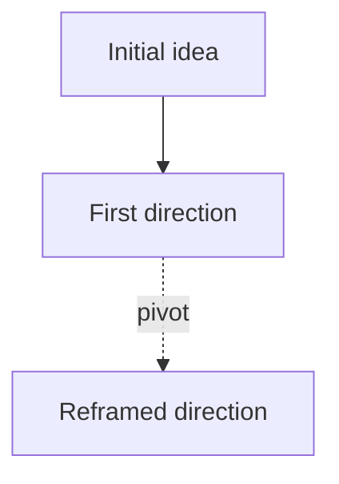

# Project log — slab-vscode

Single append-only record of decisions, pivots, ideas, findings, risks, and open
threads that future sessions must preserve. This is the project's memory.

It replaces the older split between `IDEAS_TRAIL.md` (the narrative) and
`RESEARCH_LOG.md` (the decision record): one chronological file, newest at the
bottom.

## Current state

Hand-curated orientation block. **Read this first; it saves reading the whole history.** Keep it short -- move resolved items down into the entry trail.

- **Last updated:** 2026-06-12
- **Status:** active
- **Current direction:** Slab is a shipped markdown-only companion for Culmen study notes at version 0.2.0: themed external popout preview, theme presets driving both the editor and the popout, pipe-table editing helpers, asset-path completion, and the Culmen asset layout command. The notebook pipeline has been deleted.
- **Open threads:** Marketplace publishing needs the `slab-notebooks` publisher to exist or `package.json.publisher` to be changed, plus a `VSCE_PAT` GitHub secret; revisit branding/publisher after the re-scope lands.
- **Do not repeat:** Do not package local thesis scratch files into the VSIX; `.vscodeignore` excludes them. Do not switch image links to HTML `` tags — Culmen's asset scanner only reads ``.
- **Next likely step:** Revisit Marketplace publishing — set up the publisher identity and `VSCE_PAT` secret, then tag `v0.2.0`.

## When to append

- A project direction is decided, changes, or narrows.
- An architecture, data, or hardware decision is made.
- An idea, hypothesis, or experiment worth exploring later arises.
- A run, test, or analysis produces a finding worth keeping.
- An idea is considered and explicitly rejected — with the reason.
- An earlier assumption or statement is corrected.
- A risk or unresolved question becomes load-bearing.
- A user preference is clarified well enough that future work depends on it.

Do **not** log routine Q&A, tool-use details, or ordinary implementation steps.
Filter: *would a future session be meaningfully worse off without this entry?*
If no, skip it.

## Format

```
## YYYY-MM-DD - Short title

Type: Decision

Brief context in 2-6 sentences. Include the caveat, the rejected
alternative, or the remaining uncertainty when relevant.
```

One entry, one type — pick the dominant one.

| Type | When to use |
|------|-------------|
| **Decision** | A committed direction, architecture choice, or pivot you are acting on. |
| **Pivot** | A prior direction reversed or significantly re-scoped. |
| **Idea** | A hypothesis, mechanic, or experiment worth exploring later. |
| **Finding** | A result from a run, test, or analysis. |
| **Rejected** | An option considered and ruled out, with the reason. |
| **Correction** | An earlier entry or assumption was wrong or incomplete. |
| **Risk** | A load-bearing hazard or unknown to carry forward. |
| **Reference** | An external part, source, or tool the backlog now depends on. |
| **Open thread** | An unresolved question needing follow-up. |
| **Milestone** | A shipped / ordered / verified checkpoint worth dating. |

## Append-only — supersede, never delete

Never edit or delete a past entry, even when it turns out wrong. The trail of
*why* a decision was made and later reversed is the most valuable thing in this
file — deleting it throws away the reasoning a future session needs.

When a later entry overturns an earlier one:

1. Append the new entry normally (`Correction` or `Pivot`) and name the entry it
   replaces.
2. Edit **only the type line** of the old entry to flag it:
   `Type: Decision (SUPERSEDED YYYY-MM-DD - see "<new title>")`

Leave the old body untouched. A reader can then follow the whole chain forward.

## Flowchart (optional)

<!-- When the idea evolution branches enough to be worth seeing at a glance,
keep a mermaid map here and update it on each pivot. Delete this comment if
you never use it.


-->

## Entries

<!-- Newest at the bottom. -->

## 2026-06-10 - MVP and Marketplace pipeline

Type: Milestone

Slab now has the first-phase math authoring surface: commands for inline math,
display math, equation, and align insertion; expanded LaTeX completions; sidebar
controls; and smoke coverage for insertion helpers and preview asset rewriting.
The Marketplace path uses local `@vscode/vsce`, `npm run package:vsix`,
`npm run deploy`, GitHub CI packaging, and a tagged/manual publish workflow. The
generated `slab-vscode-0.1.0.vsix` packages cleanly, but actual Marketplace
publishing still depends on external setup for the `slab-notebooks` publisher
and a `VSCE_PAT` repository secret.

## 2026-06-10 - Release check gate

Type: Finding

`npm run release:check` now verifies required Marketplace metadata/files,
GitHub workflows, smoke tests, VSIX packaging, and generated artifact contents.
The check rejects local scratch files such as `thesis.md` and repo-only agent
files if they enter the package. The current generated
`slab-vscode-0.1.0.vsix` contains only Marketplace docs, media, manifest, and
runtime source files.

## 2026-06-10 - Release tag invariant

Type: Decision

Tagged Marketplace releases must use a Git tag matching `package.json.version`
exactly, e.g. `v0.1.0` for version `0.1.0`. `scripts/release-check.mjs` enforces
this when `GITHUB_REF_TYPE=tag`, so an accidental mismatched tag fails before
packaging or publishing. This keeps iterative Marketplace updates aligned with
the version shown in the VSIX manifest.

## 2026-06-10 - Native Markdown boundary

Type: Decision

Slab should align with VS Code's native Markdown preview and notebook Markdown
renderer instead of replacing them. Native VS Code already renders KaTeX math,
Mermaid diagrams, and common Markdown preview workflows, so Slab should focus on
authoring helpers, `.md <-> .ipynb` workflow, review export, sidebar controls,
and second-screen preview where that workflow is genuinely distinct. Future
overlap with native VS Code behavior should default to deferral, narrowing, or
deletion unless a concrete gap is documented.

## 2026-06-11 - Markdown-only re-scope (notebook pipeline deleted)

Type: Pivot

Slab narrows to a lightweight markdown companion for Culmen: themed external
popout preview, theme presets driving editor + popout together, LaTeX +
asset-path completions, and pipe-table editing helpers. The `.ipynb` pipeline
(scaffold-to-notebook, review export, attachment extraction) is deleted.
Tracing the Culmen loop showed Culmen is markdown-native end to end: the
scaffold is written to `<Concept>/<Concept>.md`, Review Notes reads that same
linked file, and the asset scanner only parses `` — so the
notebook detour created dual sources of truth and an unclosed review loop.
Runnable code falls back to native VS Code Jupyter outside the review loop.
Image paste is steered to `assets/` via native `markdown.copyFiles.destination`;
HTML `` resizing was rejected as invisible to Culmen. Deferred: file-based
image resize, popout image zoom, unused-asset cleanup, scaffold-section
snippets. Spec:
`docs/superpowers/specs/2026-06-11-markdown-companion-rescope-design.md`.

## 2026-06-12 - Markdown companion re-scope shipped

Type: Milestone

The 2026-06-11 re-scope is implemented and verified: notebook pipeline deleted,
preview command renamed to `slab.openPreview`, theme presets now style the
popout preview, pipe-table editing helpers (Tab navigation, format, row/column
ops) added with a pure `tableModel.js` core, asset-path completion reads the
note's `assets/` folder, and `Slab: Use Culmen Asset Layout` points
`markdown.copyFiles.destination` at `assets/`. `npm run smoke` (8 scripts) and
`npm run release:check` pass at version 0.2.0.
